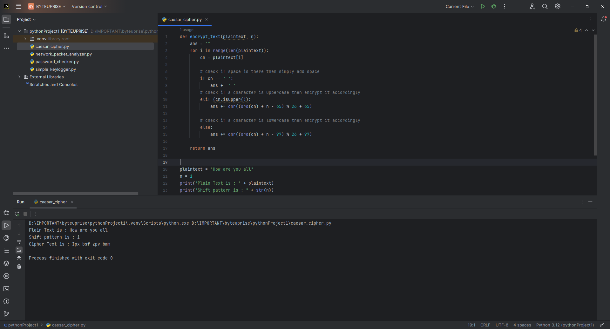

# ByteUprise_task3_CyberSecurity

Unlock the secrets of encryption with my Python script! Now you can effortlessly encode and decode messages using the Caesar Cipher algorithm. Your data stays safe with this powerful tool.

# About Caesar Cipher

The Caesar Cipher is a classical encryption method attributed to Julius Caesar, where each letter in the plaintext is shifted by a fixed number of positions in the alphabet. This technique provides a basic yet effective means of encrypting messages, making it a foundational concept in cryptography and an excellent starting point for understanding more complex encryption algorithms.

# Code
This is the code which i came up with using python [Code](caesar_cipher.py).

# Output

- Video

If the video does play its in [Here](Media/caesarcyher.mp4).

<video controls src="Media/caesarcyher.mp4" title="Caesar Cipher"></video>

- Photo

